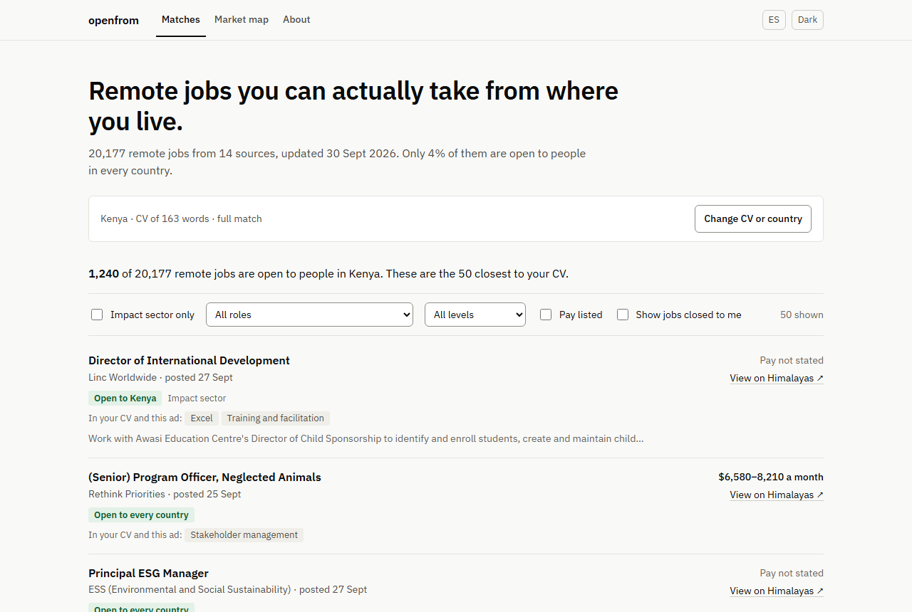

# openfrom

**Remote jobs you can actually take from where you live.** Live at [89jdvm.github.io/openfrom](https://89jdvm.github.io/openfrom/).



## The problem

Most jobs labelled "remote" are remote within one country. Of the 20,177 remote jobs the site listed on 30 September 2026, 813 (4%) were open to people in every country, and 9,675 (48%) were open only to people in the United States. Job boards rarely say this up front, so a candidate in Nairobi or Bogotá finds out after reading the ad, or after applying.

openfrom reads each ad for who can apply, and shows a visitor only the jobs they can take from their own country. It also maps the kinds of role closest to their CV: how many of those jobs are open to them, who hires, what pay the ads state, and which skills those ads ask for that the CV does not mention.

## How it works

- **Every night**, a GitHub Actions workflow collects remote jobs from public job boards and 92 employers' own career pages, and keeps jobs posted in the last 60 days. The sources and their terms are in [SOURCES.md](SOURCES.md).
- **Who can apply** comes from the ad's own words first ("must reside in", "authorized to work in", "solo residentes en", time-zone requirements), then the location the board gives. On 8,112 remote jobs from an earlier labelled study, these rules agree with that study's reading 93% of the time. An ad that names no place is marked "location not stated" and hidden by default; an empty country list is never read as open.
- **Matching** runs in the browser. The CV is split into short passages with contact details removed, each passage is turned into a vector by [multilingual-e5-small](https://huggingface.co/Xenova/multilingual-e5-small) through transformers.js, and each job is scored by its closest passage. The model downloads once (118 MB). A quick keyword match skips the download.
- **Labels** (role family, industry, seniority, contract type, employer type) are learned from 10,685 jobs labelled by AI in an earlier study. On employers held out of training, role family agrees with the checked AI labels 73% of the time and industry 60%; the other three labels were never checked and are shown as approximate.
- **English and Spanish**, for the interface and for CVs.

## Privacy

The CV never leaves the browser. There are no accounts, no server, no database, no analytics and no cookies, and the page's Content Security Policy allows requests only to this site, to Hugging Face for the model, and to the two AI providers below. The one exception is optional: a visitor can paste their own OpenRouter or Gemini key to get written fit notes, and that sends the CV to the provider they choose.

## Running it yourself

```bash
python -m venv .venv && .venv/Scripts/python -m pip install -r requirements.txt   # bin/python on macOS/Linux
npm ci
python tools/state.py download        # last night's jobs, labels and vectors
python tools/build_site_data.py       # site/public/data/
npm run dev
```

The nightly pipeline is `.github/workflows/site.yml`: fetch, merge, who can apply, embed new jobs, label, tag skills, build the site data, save state, deploy. `tools/check_public_safe.py` runs before every commit, push and state upload, and refuses anything carrying private data or full ad text.

Tests: `pytest`, `npx vitest run`, and `npx playwright test --reporter=line` against the live site (the parity test first needs `node --import ./tools/no-sharp.mjs tools/parity_node.mjs`).

## Credit

Built by Juan Diego Villacís: [portfolio](https://89jdvm.github.io/agentic-workflows-portfolio/), [LinkedIn](https://www.linkedin.com/in/jdv42), naksnack.world@gmail.com.

Code under the MIT licence. Job listings belong to their publishers; each one links back to its source.
